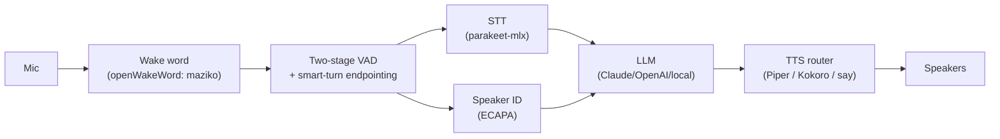

# my-stt-tts


[](https://github.com/astral-sh/ruff)

A hand-wired, low-latency **voice assistant that runs on a MacBook (Apple
Silicon)**: **wake word → speech-to-text → an LLM (streaming) → text-to-speech →
playback**, with **speaker identification** and **German / French / English**
support. On-device STT/TTS; only transcribed text ever leaves the machine.

> **Status: working prototype.** Phases 0–7 are built and tested — push-to-talk,
> typed, and wake-word modes; streaming; provider-agnostic brain (incl. no-API-key
> Claude CLI); speaker ID; "agent, …" dispatch; and **natural interruptible
> conversation** — barge-in (cancel speech mid-sentence), Smart Turn v3 prosodic
> end-of-turn (**default**, auto-downloaded on first run), false-interrupt
> suppression with an acoustic interruption predictor, context repair, bounded
> sliding-window streaming STT, and **acoustic echo cancellation** (`--aec`:
> macOS hardware `VoiceProcessingIO`, or a software NLMS filter) so barge-in
> works on open speakers, not just headphones. Now also **network audio transport**
> (`--transport websocket`) for whole-house satellites + real browser audio, and
> **in-conversation tool/function calling** (the model calls tools mid-reply) with
> an **optional cloud STT/TTS backend** (local-first). Design + roadmap: **[`PLAN.md`](PLAN.md)**.

**🔊 [Hear the voices →](https://glensk.github.io/my-stt-tts/)** — live voice-sample gallery.
**🖥️ [See the control room →](https://glensk.github.io/my-stt-tts/gui.html)** — the live `--browser` GUI (in demo mode).

## Why this exists

Off-the-shelf assistants are cloud-tethered, single-voice, and can't tell who's
speaking. This is a local, swappable pipeline where the "brain" is a pluggable LLM — Claude by default (Haiku
for speed, Opus for depth), the voices are yours to choose per language, and the
mic audio stays on your machine.

## Pipeline



| Stage | Choice (v1) | Why |
|:------|:------------|:----|
| Orchestrator   | **Python**, one warm async process            | Latency is model/network-bound; another language buys ~nothing |
| Wake word      | openWakeWord, custom phrase **"maziko"**      | Free, no vendor lock, on-device |
| Speech-to-text | `parakeet-mlx` (multilingual)                 | MLX-native, sub-second, DE/FR/EN auto-detect |
| Speaker ID     | SpeechBrain ECAPA-TDNN, enrollment + cosine   | Runs in parallel with STT → ~0 added latency |
| LLM            | Any provider — Anthropic (default), OpenAI, Ollama, local; streaming | Pluggable via OpenAI-compatible API; Haiku→Opus deep path; MCP-ready |
| Text-to-speech | Piper (DE/FR/EN) · Kokoro (EN) · `say` fallback | Only local engine strong in German *and* fast on M1 |
| Confirmations  | short **chimes**, not spoken phrases          | Spoken stage cues add ~6 s/query; chimes are language-neutral |
| Turn-taking    | push-to-talk → Silero VAD → Smart Turn v3     | Smart Turn v3 prosody is the **default** (`--turn-analyzer`, auto-downloaded on first run); falls back to a silence timer if the model/runtime is unavailable |
| Barge-in       | interrupt playback mid-sentence (`--barge-in`) | Mic stays live during TTS; confirmed speech aborts speech + LLM; false-interrupt gate **+ acoustic interruption predictor**; **AEC** (`--aec`) removes the bot's own voice so it works on open speakers |
| Transport      | local sound card · **WebSocket** (`--transport`) | `AudioTransport` seam: mic/TTS PCM over the wire for whole-house satellites + real browser audio (R2-5) |
| Tools          | in-conversation **function calling** (`tools.py`) | Model calls tools mid-reply (get_time, calculator, home_control); Anthropic + OpenAI round-trip; legacy "agent, …" still works (R2-7) |

## LLM provider

The "brain" is **provider-agnostic**. Anthropic/Claude is the default and the
recommendation, but any OpenAI-compatible endpoint works — OpenAI, Ollama, vLLM,
LM Studio, or a local server. Select it via `.env` (see `.env.example`):

| Variable | Example | Meaning |
|:---------|:--------|:--------|
| `LLM_PROVIDER`   | `anthropic`                    | `anthropic` / `openai` / `openai-compatible` / `ollama` / `claude-cli` |
| `LLM_MODEL`      | `claude-haiku-4-5`             | fast-path model id |
| `LLM_MODEL_DEEP` | `claude-opus-4-8`              | optional "deep" model |
| `LLM_BASE_URL`   | `http://localhost:11434/v1`    | for OpenAI-compatible / local servers |

## Network audio transport (R2-5)

By default the loop owns the local mic + speaker. An `AudioTransport` seam
(`transport.py`) lets it instead source mic audio and sink TTS audio **over the
wire**, so it can serve a whole-house satellite or a remote browser while the
STT/LLM/TTS pipeline stays on one machine. `LocalTransport` (sounddevice) is the
default; `WebSocketTransport` carries int16 PCM frames over a WebSocket.

```bash
# Host: run the pipeline as a WebSocket audio server (needs the `transport` extra)
uv sync --extra all                  # `all` now includes the transport extra
./mstt --transport websocket --transport-port 8770   # optional: --transport-token <secret>

# Satellite (another room / a Pi): stream its mic up, play TTS back
python -m my_stt_tts.satellite ws://192.168.1.10:8770          # --token <secret> if set
```

**Browser audio.** With `--browser --browser-audio`, the GUI's *Live Audio* button
captures your real mic via `getUserMedia`, streams 16 kHz PCM to a **same-origin**
WebSocket (`/ws/audio`, so the page's strict CSP `connect-src 'self'` allows it),
and plays the TTS PCM streamed back — the page now carries real audio, not just
state. Without `--browser-audio` the GUI stays state/transcript only (and falls
back to the scripted demo offline). The WebSocket framing is hand-rolled on the
stdlib `http.server` (`ws_frame.py`) so the GUI keeps zero runtime web deps.

## In-conversation tools + cloud backends (R2-7)

The brain supports **function/tool calling mid-conversation** (`tools.py`): the
model emits a tool call, the loop executes it, feeds the result back, and continues
streaming the spoken answer — the Anthropic *and* OpenAI tool-use round-trips are
both implemented. Shipped example tools: `get_time`, a safe `calculator`, and
`home_control` (routes to the existing agent / Home Assistant dispatch). The legacy
`"agent, …"` trigger still works; this is the inline upgrade. Toggle with
`TOOLS_ENABLED`.

An **optional cloud STT/TTS backend** sits behind the existing seams (`STT_BACKEND` /
`TTS_BACKEND` = `local`|`cloud`) — useful for a high-quality cloud **German** voice,
since local German TTS is the weak spot. It is **local-first**: cloud is selected
only when a key is present, and degrades gracefully to on-device otherwise. Both
speak an OpenAI-compatible API; no secrets are hard-coded (see `.env.example`).

## Install

> The voice loop runs from source today (Phases 1–2). Packaged installs land in
> Phase 9. **uv-first** — Homebrew is only a fallback for anything without a wheel.

```bash
# From source (works now)
git clone https://github.com/glensk/my-stt-tts && cd my-stt-tts
uv sync --extra all                 # core + STT/TTS/speaker/VAD/wake/lang backends
uv tool install piper-tts           # Piper CLI for DE/FR/EN TTS (GPL; run as a subprocess)
export ANTHROPIC_API_KEY=...        # or set LLM_PROVIDER / LLM_BASE_URL (see .env.example)
./mstt                              # push-to-talk loop (runs the venv directly; --debug for cues)

# Natural conversation: interrupt the assistant mid-sentence on OPEN speakers
# (AEC removes the bot's own voice), prosodic end-of-turn (default), and partial
# transcripts as you speak:
./mstt --wake --barge-in always --aec auto --stt-streaming

# No API key? Stripped + isolated Claude CLI (no API cost, keeps a session, ~2s/turn):
./mstt --brain haiku-sub --type     # typed input -> spoken replies
./mstt --brain haiku-api            # or the API (needs ANTHROPIC_API_KEY) — faster TTFT

# Lighter dev install — pure logic + tests only, no ML backends
uv sync && uv run pytest

# Planned (Phase 9): packaged installs
uv tool install my-stt-tts          # PyPI (planned)
brew install glensk/tap/my-stt-tts  # Homebrew tap (planned)
```

macOS `say` gives zero-install fallback voices, and `sounddevice`'s wheel bundles
PortAudio — no `brew install portaudio` needed.

**Run without `uv run`:** after `uv sync --extra all`, use **`./mstt …`** (or
`.venv/bin/my-stt-tts`). Avoid `uv run my-stt-tts` for daily use — it re-syncs and
strips the optional extras. **Customize the spoken style** by editing
`prompts/system_prompt.md`; choose a voice via `./mstt --list-voices` / `--voice`.
The `claude-cli` brain runs **stripped + isolated** (its own minimal prompt, no
tools, no access to your global `~/.claude`/`~/.llm-shared` config).

**Docker is not supported on macOS** for this app: containers there run in a
Linux VM with **no microphone/speaker access and no Apple-Silicon GPU (Metal/MLX)**
— i.e. no audio and no acceleration. Run it natively.

## Third-party licenses

This project is **Apache-2.0**. Optional backends carry their own licenses and are
invoked as **separate processes** (not linked in), so they don't change this
project's license:

| Backend | License | Note |
|:--------|:--------|:-----|
| Piper, espeak-ng        | **GPL-3.0**            | invoked as a subprocess (CLI), never imported |
| XTTS-v2 (Coqui)         | **CPML, non-commercial** | optional; personal use only |
| openWakeWord (bundled models) | **CC-BY-NC-SA-4.0** | self-trained models avoid this |
| Kokoro, SpeechBrain, Silero-VAD | Apache-2.0 / MIT | permissive (Kokoro run with espeak-ng disabled) |

## Privacy

Local STT/TTS keep audio **on-device**; only transcribed text reaches your chosen LLM provider
(Anthropic by default, as with ordinary Claude usage). Voice-enrollment profiles stay local and
gitignored. Don't dictate confidential content.

## Development

Conventions for humans and AI agents are in **[AGENTS.md](AGENTS.md)**; the design
rationale is in **[PLAN.md](PLAN.md)**.
