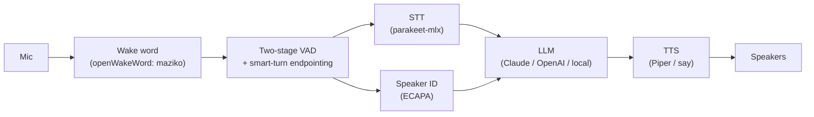

<div align="center">

<a id="top" name="top"></a>

<picture>
  <source media="(prefers-color-scheme: dark)" srcset="docs/assets/hero-dark.svg">
  <source media="(prefers-color-scheme: light)" srcset="docs/assets/hero-light.svg">
  
</picture>

<br>

<a href="#-quick-start"></a>

<br>

A private voice assistant that lives on your own machine — say a word, ask out loud, and hear a natural reply.

<br>

[](LICENSE)
[](pyproject.toml)
[](#-quick-start)
[](#-quick-start)
[](#-your-audio-never-leaves-your-mac)
[](https://github.com/astral-sh/ruff)
[](#-quick-start)

<br>

**🎙️ [What it does](#what-it-does) · ⚡ [Quick start](#-quick-start) · 🔁 [How it works](#how-it-works) · 🔒 [Privacy](#-your-audio-never-leaves-your-mac) · 🛠️ [Developers](#for-developers)**

</div>

<br>

<div align="center">

The pipeline, live — wake word → speech-to-text → LLM → speech, all on one Mac:



### 🖥️ [See the control room →](https://glensk.github.io/my-stt-tts/gui.html) &nbsp;·&nbsp; 🔊 [Hear the voices →](https://glensk.github.io/my-stt-tts/)

</div>


## What it does

- 🗣️ Talk to it hands-free — just say the wake word, no buttons.
- 💬 It replies out loud in a natural voice — a real back-and-forth, not beeps.
- 🌍 Understands and speaks **German, French, and English**.
- ✋ Interrupt it any time — start talking and it stops to listen.
- 👥 Knows who's speaking and can greet each person by name.
- 🛠️ Actually *does* things — checks the time, does the math, controls your home — not just chat.
- 💻 Use it from your laptop, another room, or your web browser.
- 🔒 Your voice never leaves your Mac — only the words you say reach the AI.
- 🧠 Pick your own brain — Claude by default (no API key needed), or OpenAI, or a fully local model.
- 🎙️ Choose your voice — calm, warm, male, female, per language.

---

## Meet your assistant

It is the assistant you wish the smart speaker on your shelf actually was: **always local, always
yours, and genuinely conversational.** You speak; it listens; it answers in a real voice — and if you
change your mind mid-sentence, you just talk over it and it stops to hear you out.

It runs entirely on a **MacBook with Apple Silicon**. The microphone audio is processed on the machine
itself; only the *words* you say are sent to the AI brain you choose. That brain is **Claude by
default — and it works with no API key at all** thanks to a bundled command-line login — or you can
point it at OpenAI, a local model, or anything in between.

> **Status — working prototype.** Everything below is built and tested today on macOS Apple Silicon.
> It runs from source; one-click installers are on the roadmap. Full design and roadmap live in
> **[`PLAN.md`](PLAN.md)**.

---

## What you can do with it

Each capability below is real and shipping. Open **Technical details** under any one for the
specifics — models, flags, and how it works under the hood.

### 🗣️ Talk to it hands-free

Say **"maziko"** and start talking. No buttons, no app to open — it is always listening for its name
and ignores everything else.

<details>
<summary>Technical details</summary>

<br>

On-device wake-word detection via **openWakeWord** with a custom-trained **"maziko"** phrase
(`wakewords/maziko.onnx`). Enable hands-free mode with `--wake`; without it you get a simple
push-to-talk or typed loop. The detector runs locally on raw mic frames — nothing is streamed
anywhere to listen for the wake word.

</details>

### 💬 It answers out loud, naturally

You ask a question by voice and hear a spoken answer in a calm, natural voice — a real conversation,
not a list of beeps.

<details>
<summary>Technical details</summary>

<br>

Speech-to-text runs locally with **`parakeet-mlx`** (MLX-native, sub-second on Apple Silicon) and
streams **partial transcripts as you speak** (`--stt-streaming`) so the reply starts sooner. The
reply is spoken by **Piper** neural voices (German, French, and English) with a built-in macOS `say`
fallback that needs zero install. Short **chimes** mark the start and end of listening — language-
neutral and far faster than spoken stage-cues. An optional cloud voice backend can be enabled for a
higher-quality voice when a key is present; it stays **local-first** and falls back to on-device
otherwise.

</details>

### ✋ Interrupt it any time

It is still listening while it talks. Start speaking and it stops mid-sentence to hear you — even
out loud on open speakers, not just with headphones.

<details>
<summary>Technical details</summary>

<br>

Full-duplex **barge-in** (`--barge-in off|headphones|always`): the mic stays live during playback,
and confirmed speech cancels both the spoken output **and** the in-flight LLM response. **Acoustic
echo cancellation** (`--aec off|nlms|voiceprocessing|auto`) removes the assistant's own voice from
the mic — either via macOS hardware `VoiceProcessingIO` or a pure-numpy NLMS adaptive filter — so
barge-in works on open speakers. A **false-interrupt gate plus an acoustic interruption predictor**
keep it from cutting itself off on stray noise, and **post-interruption context repair** trims the
conversation history to only what was actually spoken aloud, so the assistant never thinks it said
something you cut off.

</details>

### 🎯 It knows when you're done talking

It waits for you to actually finish a thought instead of cutting you off on a half-second pause.

<details>
<summary>Technical details</summary>

<br>

Turn-taking is handled by a two-stage voice-activity detector feeding **Smart Turn v3** prosodic
end-of-turn detection, which is the **default** (`--turn-analyzer smart`). The model auto-downloads
on first run and gracefully falls back to a plain silence timer (`--turn-analyzer silence`) if the
model or runtime is unavailable.

</details>

### 👥 It knows who's speaking

It can tell household members apart by voice and greet each person by name.

<details>
<summary>Technical details</summary>

<br>

Speaker identification via **SpeechBrain ECAPA-TDNN** embeddings with per-person voice enrollment and
cosine matching (with a rejection margin for unknown voices). It runs **in parallel** with
speech-to-text, so it adds effectively zero latency. Enrollment profiles are stored locally and
git-ignored.

</details>

### 🛠️ It does things, not just chat

Ask the time, ask it to do some math, or ask it to control your home — it carries out the action and
tells you the result, all in one spoken turn.

<details>
<summary>Technical details</summary>

<br>

In-conversation **function / tool calling** (`tools.py`): the model emits a tool call mid-reply, the
loop runs it, feeds the result back, and keeps streaming the spoken answer. Both the **Anthropic and
OpenAI** tool-use round-trips are implemented. Shipped example tools: `get_time`, a safe
`calculator`, and `home_control` (routes to a Home Assistant dispatch). Toggle with `TOOLS_ENABLED`.

</details>

### 💻 Use it from anywhere in the house

Run it on your laptop, stream it to another room, or watch and talk to it right in your web browser.

<details>
<summary>Technical details</summary>

<br>

A pluggable **audio transport** seam lets the same pipeline source mic audio and play replies
**over the network** (`--transport local|websocket`), so one Mac can serve a whole-house satellite
(`python -m my_stt_tts.satellite ws://<host>:<port>`) while the heavy STT/LLM/TTS stays in one place.
The **browser control room** (`--browser`, with `--browser-audio` for real mic capture via
`getUserMedia`) streams 16 kHz PCM over a same-origin WebSocket and plays the reply back — live
state, transcript, and audio in the page. The WebSocket framing is hand-rolled on Python's stdlib
(`ws_frame.py`), so the GUI carries **zero runtime web dependencies**.

</details>

### 🧠 Bring your own brain

Claude runs it out of the box with **no API key required**. Prefer OpenAI, a local model, or
something self-hosted? Point it there in one line.

<details>
<summary>Technical details</summary>

<br>

The brain is **provider-agnostic** over an OpenAI-compatible interface. Select it in `.env`
(see [`.env.example`](.env.example)):

| Variable         | Example                     | Meaning                                                                |
| :--------------- | :-------------------------- | :--------------------------------------------------------------------- |
| `LLM_PROVIDER`   | `anthropic`                 | `anthropic` / `openai` / `openai-compatible` / `ollama` / `claude-cli` |
| `LLM_MODEL`      | `claude-haiku-4-5`          | fast-path model id                                                     |
| `LLM_MODEL_DEEP` | `claude-opus-4-8`           | optional "deep" model                                                  |
| `LLM_BASE_URL`   | `http://localhost:11434/v1` | for OpenAI-compatible / local servers                                  |

The **`claude-cli`** brain shells out to a **stripped, isolated** Claude CLI — its own minimal
prompt, no tools, and no access to your global `~/.claude` config — so you get a no-API-cost,
session-keeping brain (`--brain haiku-sub`). The API path (`--brain haiku-api`) is faster to first
token if you have a key.

</details>

<div align="right"><a href="#top">↑ back to top</a></div>


## 🚀 Quick start

```bash
git clone https://github.com/glensk/my-stt-tts && cd my-stt-tts
uv sync --extra all                 # core + speech/voice/speaker/wake-word backends
uv tool install piper-tts           # neural voices for German / French / English
./mstt                              # start talking (push-to-talk; --debug shows cues)
```

No API key? The bundled Claude CLI needs none:

```bash
./mstt --brain haiku-sub --type     # type to it, hear it reply — zero API cost
```

The full natural-conversation experience — wake word, interrupt-any-time on open speakers, and
live partial transcripts:

```bash
./mstt --wake --barge-in always --aec auto --stt-streaming
```

<details>
<summary>More install options, voices, and the fine print</summary>

<br>

**Pick a voice.** List the bundled voices and choose one per language:

```bash
./mstt --list-voices
./mstt --voice amy                  # calm female (en); also ryan, kristin, lessac, thorsten (de), tom (fr)
```

**Lighter dev install** — pure logic and tests only, no machine-learning backends:

```bash
uv sync && uv run pytest
```

**Notes.**

- After `uv sync --extra all`, run the app with **`./mstt …`** (or `.venv/bin/my-stt-tts`). Avoid
  `uv run my-stt-tts` for daily use — it re-syncs and strips the optional extras.
- macOS `say` gives zero-install fallback voices, and the `sounddevice` wheel bundles PortAudio — no
  `brew install portaudio` needed. **uv-first**; Homebrew is only a fallback for anything without a wheel.
- Customize the spoken personality by editing `prompts/system_prompt.md`.
- Whole-house / browser audio needs the transport extra, included in `--extra all`. Run a satellite
  with `python -m my_stt_tts.satellite ws://<host>:<port>`.
- **Docker is not supported on macOS** for this app: containers there run in a Linux VM with no
  microphone or speaker access and no Apple-Silicon GPU (Metal / MLX) — no audio, no acceleration.
  Run it natively.
- Packaged installs (`uv tool install my-stt-tts`, a Homebrew tap) are planned.

</details>

<div align="right"><a href="#top">↑ back to top</a></div>


## 🔒 Your audio never leaves your Mac

Speech-to-text and text-to-speech run **on-device**. Only the *transcribed text* of what you say is
sent to your chosen AI brain — exactly as ordinary Claude (or OpenAI) usage would. Voice-enrollment
profiles stay local and git-ignored.

<details>
<summary>Privacy details</summary>

<br>

- The microphone signal is transcribed and spoken back **locally**; raw audio is never uploaded.
- The only thing that leaves the machine is the text prompt to the LLM provider you configure.
- Speaker profiles and any local recordings live on disk and are git-ignored.
- Don't dictate confidential content to a third-party LLM — the same caution as any cloud AI.

</details>

<div align="right"><a href="#top">↑ back to top</a></div>


## How it works

A single warm async process wires the stages together: **wake word → speech-to-text → LLM (streaming)
→ text-to-speech → playback**, with speaker ID running alongside.



<details>
<summary>The full pipeline, stage by stage</summary>

<br>

| Stage          | Choice                                                   | Why                                                                          |
| :------------- | :------------------------------------------------------- | :--------------------------------------------------------------------------- |
| Orchestrator   | **Python**, one warm async process                       | Latency is model/network-bound; another language buys ~nothing               |
| Wake word      | openWakeWord, custom phrase **"maziko"**                 | Free, no vendor lock, on-device                                              |
| Speech-to-text | `parakeet-mlx` (multilingual)                            | MLX-native, sub-second, DE/FR/EN auto-detect                                 |
| Speaker ID     | SpeechBrain ECAPA-TDNN, enrollment + cosine              | Runs in parallel with STT → ~0 added latency                                 |
| LLM brain      | Anthropic (default), OpenAI, Ollama, local — streaming   | Pluggable over an OpenAI-compatible API; no-API-key Claude CLI path          |
| Text-to-speech | Piper (DE/FR/EN) · macOS `say` fallback · optional cloud | Local-first; `say` needs zero install                                        |
| Confirmations  | short **chimes**, not spoken phrases                     | Spoken stage cues add seconds per query; chimes are language-neutral         |
| Turn-taking    | two-stage VAD → **Smart Turn v3** (default)              | Prosodic end-of-turn; falls back to a silence timer if unavailable           |
| Barge-in       | interrupt playback mid-sentence (`--barge-in`)           | Mic stays live; false-interrupt gate + predictor; **AEC** for open speakers  |
| Transport      | local sound card · **WebSocket** (`--transport`)         | Mic/TTS PCM over the wire for whole-house satellites + browser audio         |
| Tools          | in-conversation **function calling** (`tools.py`)        | Model calls tools mid-reply; Anthropic + OpenAI round-trips                  |

</details>

<details>
<summary>Third-party licenses</summary>

<br>

This project is **Apache-2.0**. Optional backends carry their own licenses and are invoked as
**separate processes** (not linked in), so they don't change this project's license:

| Backend                         | License             | Note                                              |
| :------------------------------ | :------------------ | :------------------------------------------------ |
| Piper, espeak-ng                | **GPL-3.0**         | invoked as a subprocess (CLI), never imported     |
| openWakeWord (bundled models)   | **CC-BY-NC-SA-4.0** | self-trained models avoid this                    |
| SpeechBrain, Silero-VAD         | Apache-2.0 / MIT    | permissive                                        |

</details>

<div align="right"><a href="#top">↑ back to top</a></div>


## For developers

Conventions for humans and AI agents are in **[AGENTS.md](AGENTS.md)**; the design rationale and
full roadmap are in **[PLAN.md](PLAN.md)**. Contributions and security reports: see
[CONTRIBUTING.md](CONTRIBUTING.md) and [SECURITY.md](SECURITY.md).

<div align="center">

<br>

**Local. Private. Conversational.**
🖥️ [Control room](https://glensk.github.io/my-stt-tts/gui.html) · 🔊 [Voices](https://glensk.github.io/my-stt-tts/) · 📜 [Apache-2.0](LICENSE)

<sub><a href="#top">↑ back to top</a></sub>

</div>
